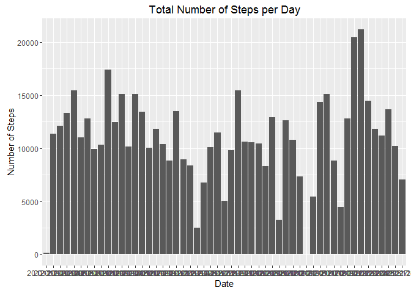
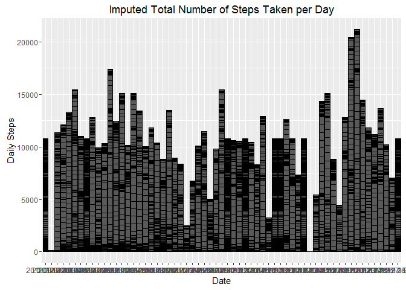

# Reproducible Data, Week 2, Assignment 1

## Introduction

It is now possible to collect a large amount of data about personal movement using activity monitoring devices such as a Fitbit, Nike Fuelband, or Jawbone Up. These type of devices are part of the "quantified self" movement - a group of enthusiasts who take measurements about themselves regularly to improve their health, to find patterns in their behavior, or because they are tech geeks. But these data remain under-utilized both because the raw data are hard to obtain and there is a lack of statistical methods and software for processing and interpreting the data.  

Using R, an assignment to monitor and understand the movements and activity paterns of one keen individual has been recorded below.  The code chunks utilized for this assignment and their results are also presented below. 

## Download the Data

In case you haven't already downloaded the data the traditional way (click on it, browser indicates it has been downloaded, and open it from the folder you download into), here is the way we download it in Coursera:

First set the directory.  

```r
# setwd("c:/users/ENTER WORKING DIRECTORY")
```

Download the file from the url given

```r
## 1. Code for reading in the dataset and/or processing the data
url <- "https://d396qusza40orc.cloudfront.net/repdata%2Fdata%2Factivity.zip"
if(!file.exists("./Reproducible Research")) {dir.create("./Reproducible Research")}
download.file(url, destfile="./Reproducible Research/AMD.zip")
```

You should now have the "AMD.zip" inside a folder called "Reproducible Research", all inside the directory you have set to work in.  Now set your directory to "Reproducible Research"

Unzip the file


```r
unzip("AMD.zip")
# a file called 'activity.csv' is now available.  We need the data from here
AMD.Data <- read.csv("activity.csv")
```

## Say Hello to your Data

It's always good to do a little exploring to understand what data the file contains and what you're dealing with. Things we learned in Coursera focus on checking what the headers are, how many observations, how many variables, what type of data this is, etc..  then cleaning the data, and making it ready for use. 
Let's 'str'ip the file to get a sense of the 'str'ucture


```r
str(AMD.Data)
```

```
## 'data.frame':	17568 obs. of  3 variables:
##  $ steps   : int  NA NA NA NA NA NA NA NA NA NA ...
##  $ date    : Factor w/ 61 levels "2012-10-01","2012-10-02",..: 1 1 1 1 1 1 1 1 1 1 ...
##  $ interval: int  0 5 10 15 20 25 30 35 40 45 ...
```

This gives us an idea of the number of observations (which you can see if you have the global environment pane in R-studio open), and what the variables are, and what class they are. In this case integers and characters.  

The other thing we should also do, since it has been requested in the assignment, is to ensure we can show the results without having to set the options for each data-chunk.  So to do that we must update the global options for this markdown document.

Let's fire up knitr

```r
library(knitr)
```


```r
opts_chunk$set(echo=TRUE)
```

Now let's start tackling the assignment questions. 

## What is the Mean Total Number of Steps Taken per Day?

1. Calculate the total number of steps taken per day and, 2. show it in a histogram.

First, let's clean the data a little bit to get rid of the pesky "NA" values. 


```r
AMD.Data.NAless <- na.omit(AMD.Data)
```

This makes the data easy to see and create a plot since we now have each day and the total number of steps without missing values that might give the wrong observations. 

Next, the request is to "commit containing full submission with a barplot of the number of steps taken each day". 

I like ggplot2, so I will use it to make the plot.  So first we call it, and then get the total steps per day. 


```r
library(ggplot2)
totalsteps <- tapply(AMD.Data.NAless$steps, AMD.Data.NAless$date, FUN=sum)
## you can check the output of this:
head(totalsteps)
```

2012-10-01 2012-10-02 2012-10-03 2012-10-04 2012-10-05 2012-10-06 
        NA        126      11352      12116      13294      15420 

Now the data can be used to plot in ggplot and geom_bar().


```r
g <- ggplot(AMD.Data.NAless, aes(date,steps))
# 2. Histogram of the total number of steps taken each day
# then build it from here
# when using geom_bar there is no need to indicate the binwidth because it
# counts the number of unique observations for you. And we add labels.
g+geom_bar(stat="identity")+labs(title="Total Number of Steps per Day", x= "Date", y="Number of Steps")
```

<!-- -->

Moving on to the next part of the question : 3. Calculate and report the mean and median of the total number of steps taken per day

We can do this in one call:


```r
# 3.  Mean and median number of steps taken each day
summary(totalsteps)
```

```
##    Min. 1st Qu.  Median    Mean 3rd Qu.    Max.    NA's 
##      41    8841   10760   10770   13290   21190       8
```

The mean is 10770, and median is 10760.

## What is the Average Daily Activity Pattern?

I understand this like tryig to answer the question "when is this person usually busy, usually relaxing, usually physically active" etc... So it makes me want to look at the daily readings. 

The assignment requires us to:  
1.  Make a time series plot (i.e. type = "l") of the 5-minute interval (x-axis) and the average number of steps taken, averaged across all days (y-axis).  

When we look at the str(AMD.Data.NAless) output, we notice the data mentioned in the question with 5-min intervals under "interval".  So have it in a plot and have a quick look at it, we first aggregate on steps ~ interval. (we'll just used Rs base plotting here, for less scripting)


```r
# 4. Time series plot of the average number of steps taken
AvgDailyActPat <- aggregate(steps~interval, data=AMD.Data.NAless, FUN=mean)
plot1 <- plot(AvgDailyActPat, type="l")
```

<!-- -->

```r
plot1
```

```
## NULL
```

What is the max average steps?


```r
#  5. The 5-minute interval that, on average, contains the maximum number of steps
AvgDailyActPat$interval[which.max(AvgDailyActPat$steps)]
```

```
## [1] 835
```

## Imputing missing values

Up to now, based on the above data analysis choices, we've been working with the 'clean' data - ie no missing values.  The next section requires us to take those into account and figure out a way to fill in the missing data.  So let's calculate and report how much missing data (total NAs) there is from the original data set? 


```r
sum(is.na(AMD.Data))
```

```
## [1] 2304
```

Now let's "Devise a strategy for filling in all of the missing values in the dataset. The strategy does not need to be sophisticated. For example, you could use the mean/median for that day, or the mean for that 5-minute interval, etc." "

Just for the sake of this assignment I've chosen the mean - it would make the most sense in this author's opinion for this particular type of case. (ie the mean of the daily interval). The assignment hints at making a "new dataset that is equal to the original dataset but with the missing data FILLED IN - so we cannot use AMD.Data.NALess since that dataset simply ignores or removes the NAs. 

```r
# create a new dataset that is equal to the original but with the missing data filled in. 
ImputedAMD <- merge(AMD.Data, AvgDailyActPat, by= "interval", suffixes = c("", ".y"))
NAvals <- is.na(ImputedAMD$steps)
ImputedAMD$steps[NAvals] <- ImputedAMD$steps.y[NAvals]
ImputedAMD <- ImputedAMD[, c(1:3)]
```

Now to make the plot - using ggplot again here. 


```r
# make a histogram of the total number of steps taken each day with the above new dataset.
g2 <- ggplot(ImputedAMD, aes(date,steps))
plot2 <- g2+geom_bar(stat="identity", color = "black")+labs(title="Imputed Total Number of Steps Taken per Day", x="Date", y="Daily Steps")
plot2
```

<!-- -->

To calculate the mean and median, we'll to first sum up the the data by using tapply to the subset of vectors $steps and $interval, then use the mean and median functions otherwise we get incorrect info by each 5-min interval rather than the total: 

```r
totalimputedsteps <- tapply(ImputedAMD$steps, ImputedAMD$date, FUN = sum)
mean(totalimputedsteps)
```

```
## [1] 10766.19
```

```r
median(totalimputedsteps)
```

```
## [1] 10766.19
```

#### Q: Do these values differ from the estimates from the first part of the assignment? 
Yes. So the result shows that the new mean is less than the old one by roughly 4 steps (10766.19 - 10770).  And the new Median is is higher by roughly 6 teps (10766.19 - 10760).

#### Q: What is the impact of imputing missing data on the estimates of the total daily number of steps?  
It is Hardly a noticeable change per instance, but over a longer time scale (eg a month) the differences will really add up :). 

## Are there differences in activity patterns between weekdays and weekends?

So in the next part of the assignment we must determing if our subject is more active during the weekend or the weekdays.  The tip provided in the assignment is to use the weekdays() function (if you've never used before, like me, or heard about it just type ?weekdays and you'll get some info on it)

In order for R to treat the "date" variable as a date class object, we must c
convert it.  Earlier we saw it was a character class.  To make it a date class:

NOTE: as I really struggled with this part, I eventually had to look at many many solutions and suggestions which were posted online - many which were too advanced for my level of R, but I found one which I eventually used as a guide [here][1].
[1]:http://rstudio-pubs-static.s3.amazonaws.com/22372_0b43aa70ec2e4146b17b7c05d2b5245f.html


```r
ImputedAMDdays <- ImputedAMD
Weekenddays <- weekdays(as.Date(ImputedAMDdays$date)) %in% c("Saturday", "Sunday")
ImputedAMDdays$daytype <- "Weekday"
ImputedAMDdays$daytype[Weekenddays == TRUE] <- "Weekend"
ImputedAMDdays$daytype <- as.factor(ImputedAMDdays$daytype)

# test it out

head(ImputedAMDdays)
```

```
##   interval    steps       date daytype
## 1        0 1.716981 2012-10-01 Weekday
## 2        0 0.000000 2012-11-23 Weekday
## 3        0 0.000000 2012-10-28 Weekend
## 4        0 0.000000 2012-11-06 Weekday
## 5        0 0.000000 2012-11-24 Weekend
## 6        0 0.000000 2012-11-15 Weekday
```

Next, we are requested to "Make a panel plot containing a time series plot (i.e. type = "l") of the 5-minute interval (x-axis) and the average number of steps taken, averaged across all weekday days or weekend days (y-axis)."


```r
# daily average steps by daytype
AvgStepsByDayType <- aggregate(steps ~ interval + daytype, ImputedAMDdays, mean)
names(AvgStepsByDayType)[3] <- "Avg_Steps"
library(lattice)
plot3 <- xyplot(Avg_Steps ~ interval | daytype, AvgStepsByDayType, type="l", layout=c(1,2), main = "Weekend vs Weekday Average Number of Steps", xlab="5 min Interval", ylab="Avg Steps taken")
plot3
```

<!-- -->
